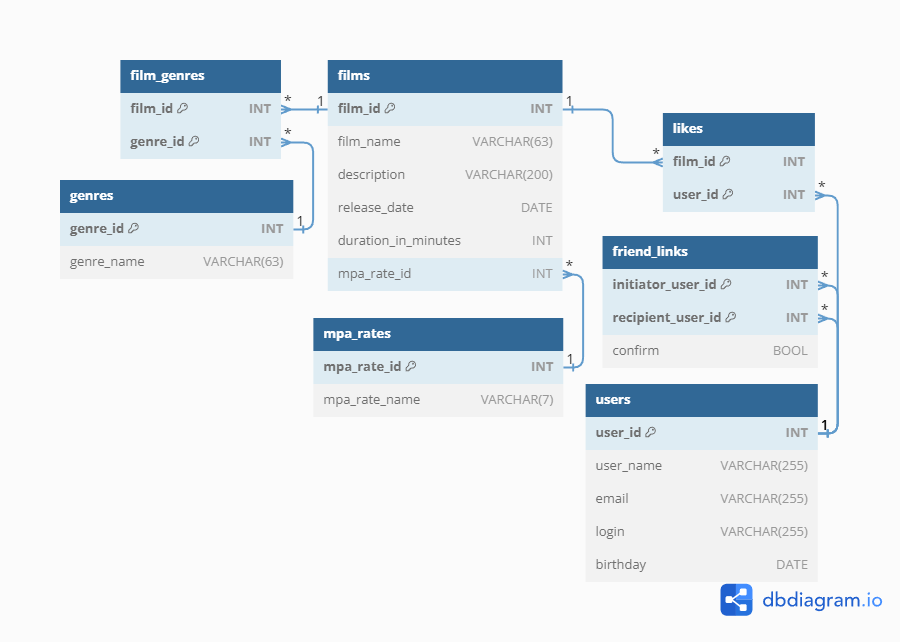

# Filmorate
####
### General
#### The project was completed as part of a task on Yandex practicum.

This project provides an opportunity to evaluate films and share your ratings. The main functionality includes:
- Add and update films;
- Add and update users;
- Users can likes films;
- Users can request a list of popular movies (according to the likes received);
- Users can send a friendship request and confirm them.

### Technology stack:

- [Java 11](https://docs.aws.amazon.com/corretto/latest/corretto-11-ug/downloads-list.html)
- [Spring](https://start.spring.io) (Boot, MVC),
- [H2](https://www.baeldung.com/spring-boot-h2-database)
- [Maven](https://www.enterprisedb.com/downloads/postgres-postgresql-downloads)

#### Also used
- JDBC
- lombok
- JUnit

### ER-diagram:
